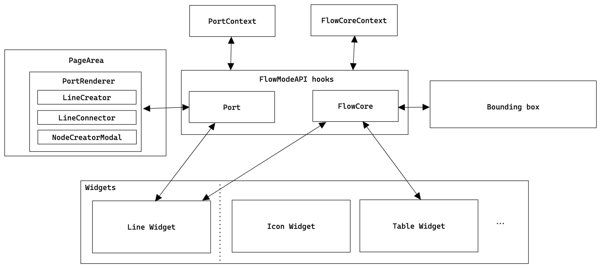
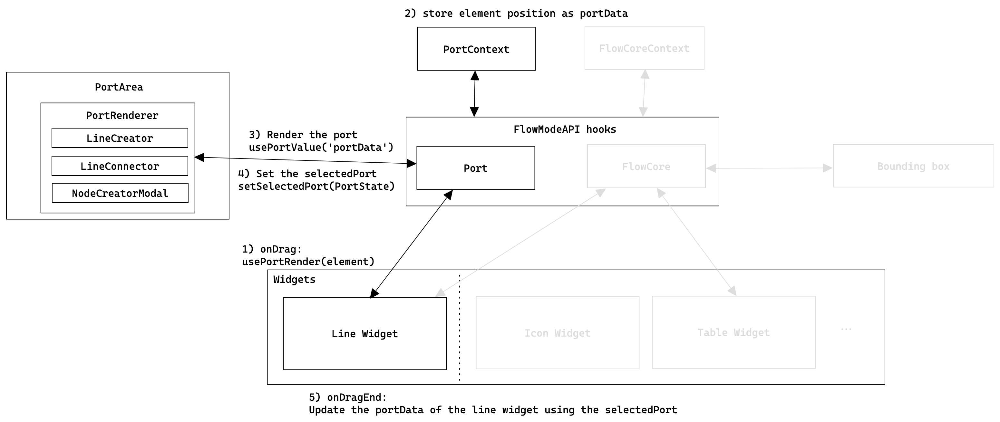
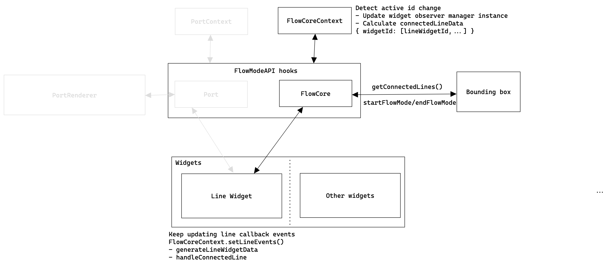
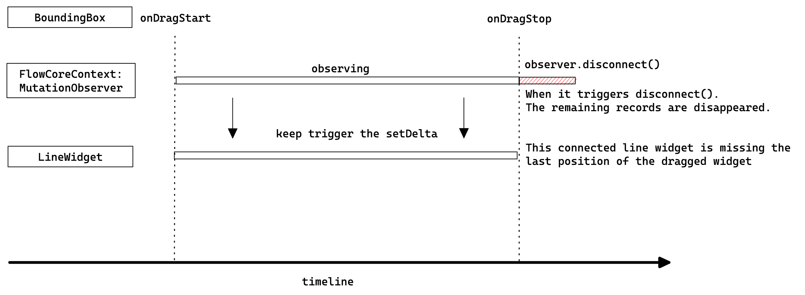
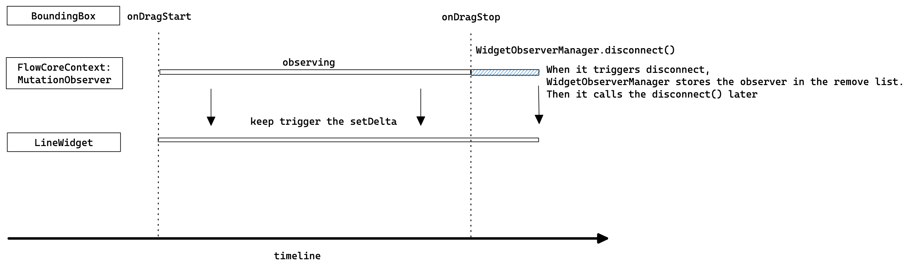
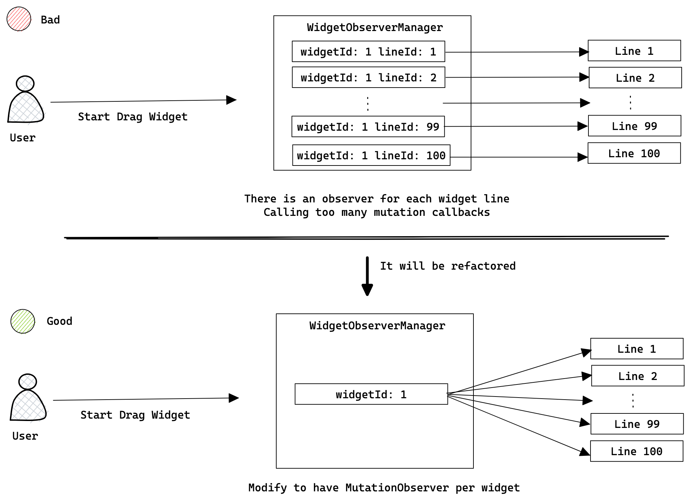

# Flow Mode

Flow mode is a module that provides features such as improved line widgets and diagramming methods to connect widgets that use the widget base in the Editor 2

All data is delegated to the line widget, and calculations are handled in the frontend.

- [Flow Mode](#flow-mode)
  - [What is the Flow Mode](#what-is-the-flow-mode)
    - [Comparison with existing smart diagram](#comparison-with-existing-smart-diagram)
  - [Architecture](#architecture)
    - [overall structure](#overall-structure)
      - [- FlowModeAPI hooks](#--flowmodeapi-hooks)
      - [- PortContext](#--portcontext)
      - [- FlowCoreContext](#--flowcorecontext)
      - [- PortRenderer](#--portrenderer)
    - [Rendering the port](#rendering-the-port)
    - [Updating connected lines](#updating-connected-lines)
      - [Initialize](#initialize)
      - [Dragging widgets with connected lines](#dragging-widgets-with-connected-lines)
  - [Flow Mode API hooks](#flow-mode-api-hooks)
    - [Flow Core hooks APIs](#flow-core-hooks-apis)
      - [useFlowCore](#useflowcore)
      - [useFlowMode](#useflowmode)
      - [Subscribe the lineWidget events](#subscribe-the-linewidget-events)
      - [useFlowCoreValue](#useflowcorevalue)
      - [useSetFlowCoreState](#usesetflowcorestate)
    - [Port Renderer hooks APIs](#port-renderer-hooks-apis)
      - [usePortRender](#useportrender)
      - [usePortValue](#useportvalue)
      - [useSelectedPortState](#useselectedportstate)
- [Solved issues](#solved-issues)
  - [Race condition](#race-condition)
  - [Performance Optimization](#performance-optimization)
    - [Optimize line rendering](#optimize-line-rendering)
    - [Mutation observer management function](#mutation-observer-management-function)
    - [Update setEvent function like a framer motion](#update-setevent-function-like-a-framer-motion)
    - [Triggering too many mutated callbacks](#triggering-too-many-mutated-callbacks)

## What is the Flow Mode

1. All data is stored in the line widget.

2. Functions are provided through FlowCoreContext and PortContext.

- FlowCoreContext: Function and state management for **dynamic updating of connected lines**
- PortContext: Widget state management for **line connection**

3. The above functions are provided through FlowCoeAPI hooks.

4. All functions are used the widget base, so no effort from engineers is required when adding widgets.

### Comparison with existing smart diagram

[E2 Diagram Design Alpha v2
](https://venngage.atlassian.net/wiki/spaces/EN/pages/2107736076/E2+Diagram+Design+Alpha+v2)

## Architecture

### overall structure



#### - FlowModeAPI hooks

Interface that provides API hooks for using PortContext and FlowCoreContext.
More details are available in the Flow Core hooks APIs section

#### - PortContext

This is the Context that stores the state of the port for line connection.
It renders the port and save the selected port's data as state

```ts
// State
portData: PortWrapperData; // Position for rendering the PortRenderer component.
selectedPort: PortState; // stored selected port data
setSelectedPort: Function; // Update selected port data
render: Function; // for rendering the PortRenderer on the page
clear: Function; // for removing the PortRenderer on the page
```

> **_NOTE:_** A **port** is an interaction point for connecting lines.

#### - FlowCoreContext

This is the Context that manages the mutation observer callbacks of connected lines.

```ts
// Context state
isEnabled: boolean; // For checking the flowMode is are enabled/disabled
isObserving: boolean; // For checking the observing state
start: Function; // Start observe by updaing isObserving state
stop: Function; // Stop observe by updaing isObserving state
setIsEnabled: Function; // Toggle the flowMode function
flowCoreEvent: Function; // Setter to use latest line widget data
getConnectedLines: Function; // Returns the updated connected line data for batch widget updates.

// Internal State
observerManagerInstance: MutableRefObject<WidgetObserverManager>; // An instance of WidgetObserverManager that manages mutation callbacks for each connected line.
lineWidgetFunctionList: MutableRefObject<LineWidgetEvents[]>; // Callback functions stored to use the latest line widget data and functions
connectedLineData: ConnectedLineData; // key-value object to store the connected line datas
// e.g.) { [key: WidgetId]: LineWidgetId[] }
```

#### - PortRenderer

A component that renders ports for connecting lines.

It is separated into 3 components to implement port rendering functionality.

- LineCreator: Render the port on the selected widget to connect/create the line.
- LineConnector: Render the port on the hove overed widget to connect the line.
- NodeCreatorModal: Show modal to add the new widget after dragging the port.

### Rendering the port



### Updating connected lines



#### Initialize

- FlowCoreContext detects active widget id changes. when It changed, it updated the observer list and calculate the connectedlineData.
- Line widget keep sets the latest function callbacks to the FlowCoreContext.

#### Dragging widgets with connected lines

- When a specific widget is being dragged, a mutation observer is executed if there is a line connected to that widget.
- At this time, the mutation callback updates the line by calling the latest stored function in the FlowCoreContext to change the setDelta state in the Line Widget of all connected line widgets.

## Flow Mode API hooks

Since the context is not a simple state management, specific API hooks are provided through the FlowMode API to avoid confusion in use.

Some of the API naming is inspired by Recoil that is the atom statement management library for React.

e.g.)

```ts
// Recoil is using the atomState
// But, This API accepts a key string instead of the atomState.
useRecoilValue(state) => useFlowCoreValue(key)
useSetRecoilState(state) => useSetFlowCoreState(key)
```

The FlowMode API list is here:

### Flow Core hooks APIs

#### useFlowCore

Use all values ​​provided by FlowCoreContext.

#### useFlowMode

This code activates the mutation observer list that stored in the FlowCoreContext.
At this time, only the activeWidgetIds(selected widgets) observer is activated.

```ts
const [startFlowMode, stopFlowMode] = useFlowMode();

// When event starts
onDragStart = () => {
  startFlowMode();
  //...
};

// When event ends
onDragEnd = () => {
  //...
  endFlowMode();
};
```

#### Subscribe the lineWidget events

For generating the line datas, All necessary functions are stored in FlowCoreContext for communication between boundingbox and line widget

Mutation callback is an async function and bounding box events and line widgets for generating line data.

More details are explained in the **Race Condition** section.

```tsx
// LineWidget.tsx

// It's inspired by the onChange event of framer-motion library
useEffect(() => {
  flowCoreEvent.onChange(widgetId, setDeltaCallback, getLineDataCallback);
});
```

#### useFlowCoreValue

API to get **getter** provided by FlowCoreContext.
Autocomplete for getter value is provided.

#### useSetFlowCoreState

API to get **setter** provided by FlowCoreContext.
Autocomplete for getter value is provided.

### Port Renderer hooks APIs

#### usePortRender

API to render the port using the HTMLElement of the target widget.

```ts
const [renderPort, clearPort] = usePortRender();

// Render the port on the target widget
renderPort(targetElement, type: PortTypes);

/*
export enum PortTypes {
  Creator = 'creator',
  Connector = 'connector',
}
*/

// Remove the port component on the editor
clearPort();

```

#### usePortValue

API to get **getter** provided by PortContext.
Autocomplete for getter value is provided.

#### useSelectedPortState

API to get **getter and setter of the selectedPort** provided by PortContext.

# Solved issues

## Race condition

- Mutation Callback is using the async funciton.
- If we disconnect observer, all remaining records(mutation callback) doesn't triggered.
- It is using the transform data of the current element's style to generate matrix value.
- Due to the above reasons, mutation callbacks are stored late in the event loop, so disconnection and call timing problems may occur.





Also regarding the BoundingBox event,
When we do batch saving of widget data, we must create line data before changing the style to generate the correct updated value.

## Performance Optimization

- [x] Optimize line rendering
- [x] Mutation observer management function
- [x] Update setEvent function like a framer motion
- [x] Triggering too many mutated callbacks

### Optimize line rendering

In order to separate the entire Line Widget rendering from the SVG rendering inside the Line Widget, it is managed as a separate posList.

### Mutation observer management function

Create a class that can pre-initialize and manage MutationObserver.
Use that class to control removing, adding, observing, and disconnecting multiple MutationObservers.

### Update setEvent function like a framer motion

Inspired by the onChange event of framer motion, It has been refactored it so that lineWidget can easily subscribe the event as a callback.

```tsx
// LineWidget.tsx
useEffect(() => {
  flowCoreEvent.onChange(widgetId, setDeltaCallback, getLineDataCallback);
});
```

### Triggering too many mutated callbacks

Depending on the performance of the computer, it is currently a simple straight line, so connecting more than 50 lines will increase the lag.

In order to separate the entire Line Widget rendering from the SVG rendering inside the Line Widget, it is managed as a separate posList.

This is because MutationObserver is being created for each connected line widget.
It can be refactored like the below image.



It was implemented like the `Bad case`in the above image because it included line-related functions in the existing mutation callback.
However, since certain functions were delegated to the line widget during the refactoring process, it can be improved such as `Good case` in the image
