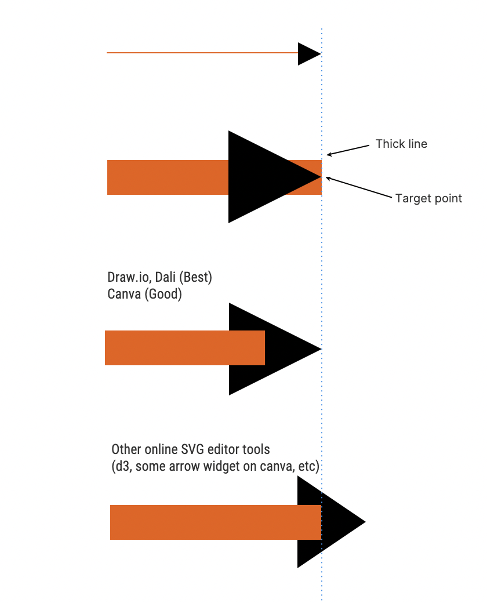
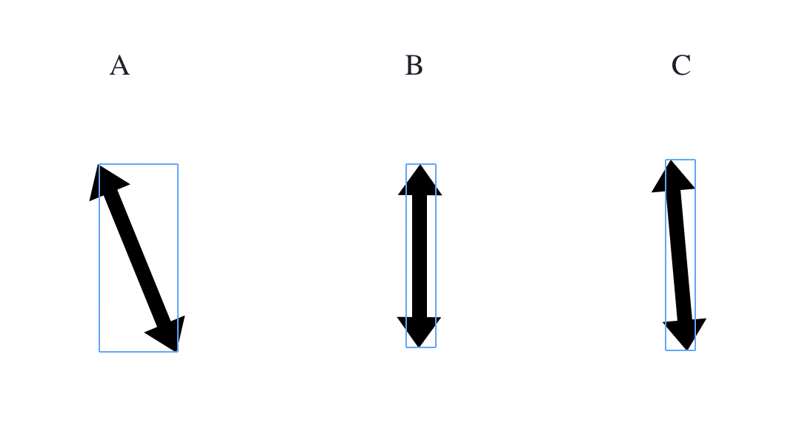

# Line Widget

## Goals

It is a flexible line widget that supplements the shortcomings of the line widget that the existing Venngage editor has.

- **Legacy Line Widget:** 
Inflexible because the entire widget is rotated using the rotate value. 
It looks like the arrow direction is rotated, but it actually rotates the entire widget.
 
- **Smart Widget:**
Fixed arrow directions of up, down, left and right. 
For that reason, arrows exist only in stepped line, and when you change to straight or curved lines, the arrow disappears.

## Solved issues

### SVG width & height issue

We must use integers for the SVG width and height values.
SVG has a problem with strangely applying the stroke width if that value is lower than 1px or contains a decimal point. 

### 64-bit floating point 

It is necessary to be careful because coordinates are calculated a lot.
Be careful as this may calculate an incorrect value or enter an wrong value in the SVG path.

[Link](https://medium.com/@sarafecadu/64-bit-floating-point-a-javascript-story-fa6aad266665)

### Arrow with thick line issue

When trying to point with an arrow using the target's XY coordinates, there is a problem that the line covers the arrow depending on the thickness of the line.



To solve this problem, there is a way to change the start and end position when the arrow is displayed.

Only a few smart SVG editors solve the problem this way. 
(e.g. Draw.io, Pitch.com, Dali and Canva)
However, Most SVG tools draw an arrow header in the center of the target so arrow header is usesless in those tools

### SVG line widget structure by service

- Draw.io

```xml
<svg>
  <line></line>
  <path></path> <!-- Start arrow shape -->
  <path></path> <!-- End arrow shape --> 
</svg>
```

- Pitch

```xml
<svg>
  <g>
    <def>
      <marker id="marker-id" orient="auto-start-reverse">
        <path></path>
      </marker>
    </def>
    <line marker-start="marker-id" marker-end="marker-id">
  </g>

  <!-- Handler -->
  <g></g>
</svg>
```

- Canva

only end arrow is under the g tag, it's weird
```xml
<svg>
  <line></line>
  <path></path> <!-- Start arrow shape -->
  <g> 
    <path></path> <!-- End arrow shape -->
  </g>
</svg>
```

- Dali

```xml
<svg>
  <def>
    <symbol id="big-sharp">
      <path></path>
    </symbol>
  </def>
  <polyline>
  <use xlink:href="#big-sharp" transform="translate(0, 0) rotate(45)">
  <use xlink:href="#big-sharp" transform="translate(100, 100) rotate(225)">
</svg>
```

- Editor2

It is similar to the structure of Pitch, but the pitch is very simple because there are no multi-shaped lines or arrows.

Therefore, Editor2 separates the path into two to implement dynamic line change and arrow shape change.

```xml
<svg>
  <def>
    <marker id="marker-id" orient="auto-start-reverse"></marker>
  </def>
  <path> <!-- Line -->
  <path marker-start="marker-id" marker-end="marker-id"> <!-- Arrow -->
</svg>
```

**Line path:** When there is an arrow, the coordinates of the start and end points are changed to solve the thick line issue.

**Arrow path:** In order to have the correct curve of the arrow in the curve line, the coordinates of the start and end points are used without changing the coordinates.

### Line widget position data

This widget stores three types of point objects.
```ts
type Pos {
  xPx: number,
  yPx: number,
}

- startPos: Pos
- midPosList: Pos[]
- endPos: Pos
```
It will generates one posList =>

```ts
const posList = [
  startPos,
  ...midPosList,
  endpos,
];

posList[0] // start position handler
posList[posList.length - 1] // end position handler
```

It renders the DragHandler based on the posList.
So, the posList and the dragHandler will have the same index.

When setting the delta data in the drag event, set the targetIndex as well.
It detects and updates the delta value in the rendering part using index

```ts
type DeltaPos = {
  target?: HTMLDivElement; // drag handler's html ref
  index?: number; // It is the index for the drag handler and posList
  xPx: number;
  yPx: number;
};
```

### Vertical and Horizontal Line issue

This widget uses the value of posList to calculate the widget size.
For that reason, if the line is diagonal, it will have the expected widget size.
However, if it is a vertical or horizontal line, widget size is really narrow.

Therefore, It checks the minimum size when saving the data, and if the widget xPx or yPx is smaller than the minimum size, forcefully expand the widget size.


- A: It is larger than the minimum width of 20px, so the size of the widget is applied using the line position.
- B: Since the widget's widthPx is 0 for this vertical line, Therefore, line uses the minimum width value to increase the widget size.
- C: As for the slightly diagonal line, the widget's widthPx is smaller than 20px, so increase the size using the minimum width size.

## Helper functions

TODO: [JB] add more detail here
